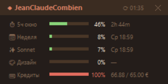
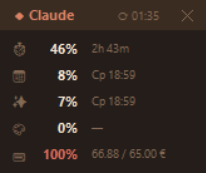
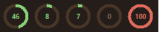

# JeanClaudeCombien

> **The only usage monitor built specifically for the Claude Desktop app (Windows).**  
> Other tools require a browser session or CLI credentials — this one reads directly from the Desktop app, no browser needed.

Compact always-on-top overlay that shows your real-time **Claude usage stats** — 5-hour window, weekly limit, Sonnet, Claude Design, and extra credits — directly on your desktop.

No browser tab juggling. No digging through settings.

  

---

## What it shows

| Metric | Description |
|---|---|
| ⏱ **5h window** | 5-hour rolling window usage |
| 📅 **Week** | 7-day total usage |
| ✨ **Sonnet** | Claude Sonnet usage |
| 🎨 **Design** | Claude Design (Artifacts) usage |
| 💳 **Credits** | Extra credits used / monthly limit |

Color-coded progress bars / rings: green → yellow → red as limits approach.

**Four modes:**
- **Full** — progress bars + labels + reset countdowns
- **Compact** — icon + % + time to reset (165 px wide)
- **Dock** — donut-ring strip (44 px tall) that snaps above the Windows taskbar
- **Tray** — single status ring in the system tray; left-click for hover card, right-click for menu

Double-click the header to toggle full ↔ compact. Right-click → ⊞ Dock mode to go minimal.

---

## Languages

Right-click the overlay → **🌐 Language** to switch instantly. Setting persists across restarts.

| Code | Language |
|---|---|
| `en` | English |
| `fr` | Français |
| `es` | Español |
| `ru` | Русский |
| `lg` | Luganda |

Want to add your language? Edit [`i18n.py`](i18n.py) — copy any block, add a new key, translate the values. One file, no build step.

---

## Requirements

- **Windows 10 / 11**
- **Python 3.10+** — [python.org/downloads](https://python.org/downloads/) *(check "Add Python to PATH" during install)*
- **Claude Pro or Max account** on [claude.ai](https://claude.ai)
- Claude Desktop app *(optional — the overlay works standalone)*

---

## Installation

### 1. Download

Click **Code → Download ZIP**, extract anywhere (e.g. `C:\JeanClaudeCombien\`).

Or clone:
```
git clone https://github.com/tvagafonov-lab/JeanClaudeCombien.git
cd JeanClaudeCombien
```

### 2. Run the installer

Double-click **`install.bat`**

It will:
- Check Python version
- Install dependencies (`cloudscraper`, `requests`)
- Create a Windows **autostart shortcut** (runs on login)
- Open the setup window

### 3. Enter your sessionKey

The setup window explains exactly where to find it:

1. Open **Chrome** and log in to [claude.ai](https://claude.ai)
2. Press **F12** → **Application** tab
3. **Storage → Cookies → https://claude.ai**
4. Find the row **`sessionKey`**
5. Click it → select all in the Value field → copy
6. Paste into the setup window → **Save**

The key looks like: `sk-ant-sid02-XXXX...` (~131 characters).

> **One-time step.** The key is stored locally in `%APPDATA%\Claude\monitor_session.json` and never leaves your machine.

---

## Usage

After setup, the overlay starts automatically with Windows.

To start it manually: double-click **`start_monitor.bat`**

**Controls:**
| Action | Result |
|---|---|
| Drag | Move the window anywhere |
| Double-click header | Toggle compact / full mode |
| Double-click (dock) | Exit dock mode |
| Right-click | Context menu (mode, %, opacity, language, close) |
| ✕ button | Close |

Settings (position, opacity, mode, language) are saved automatically to `%APPDATA%\Claude\monitor_settings.json`.

---

## Updating the sessionKey

Sessions expire after a few weeks. When usage data stops updating:

1. Re-run **`setup.py`** (or `python setup.py`)
2. Get a fresh key from Chrome DevTools (same steps as above)
3. Paste and save

---

## How it works

- **Token count** (`tokens-today`) is read from Claude Desktop's local file:  
  `%APPDATA%\Claude\buddy-tokens.json`

- **Usage percentages** are fetched from the claude.ai private API:  
  `https://claude.ai/api/organizations/{orgId}/usage`  
  using your `sessionKey` cookie via [cloudscraper](https://github.com/VeNoMouS/cloudscraper) (handles Cloudflare JS challenge transparently).

- Your `orgId` is auto-detected on first run and cached locally.

- Data refreshes automatically: the overlay watches `buddy-tokens.json` for changes (every 5 s) and triggers an API call within 30 s of any Claude Desktop activity.

---

## Files

```
JeanClaudeCombien/
├── claude_monitor.py   # Main overlay (tkinter)
├── fetch_usage.py      # Fetches usage from claude.ai API
├── i18n.py             # All translations — edit here to add a language
├── setup.py            # First-time sessionKey setup GUI
├── requirements.txt    # Python dependencies
├── install.bat         # One-click installer
└── start_monitor.bat   # Launch overlay manually
```

User data (not in repo, stored in `%APPDATA%\Claude\`):
- `monitor_session.json` — your sessionKey
- `monitor_org.json` — cached org ID
- `monitor_usage_cache.json` — last fetched usage data
- `monitor_settings.json` — position, opacity, mode, language

---

## Troubleshooting

**"Ошибка подключения" in setup**  
→ Make sure you're logged into claude.ai in Chrome and the sessionKey is copied correctly (all ~131 chars).

**Usage not updating after reboot**  
→ Your sessionKey expired. Re-run `setup.py` with a fresh key.

**HTTP 401 / 403 errors**  
→ Session expired. The overlay auto-opens the setup window when this happens — paste a fresh sessionKey there. If the window doesn't appear within ~60 s, run `python setup.py` manually.

**Window not visible**  
→ It may be off-screen. Delete `%APPDATA%\Claude\monitor_settings.json` and restart — it will reappear in the bottom-right corner.

**Tray icon doesn't appear**  
→ Windows 11 hides new tray icons by default. Open **Settings → Personalization → Taskbar → Other system tray icons** and enable the JeanClaudeCombien entry.

**Tray icon disappears after I kill / restart the overlay**  
→ Known Win11 quirk. The shell caches `(ExecutablePath, GUID)` pairs for `NotifyIcon` registrations and silently rejects re-registration of the same GUID inside an already-running session. Fix: **sign out of Windows and sign back in**. The autostart shortcut will then start in a clean shell state and register the tray icon cleanly. Avoid `Stop-Process` / Task-Manager-killing the overlay during a session — toggle out of tray via right-click → "Exit tray" instead.

**"Python not found" in install.bat**  
→ Reinstall Python from [python.org](https://python.org/downloads/) and check **"Add Python to PATH"**.

---

## Privacy

All data stays on your machine. The only outbound request is to `claude.ai` using your own session cookie — the same request your browser makes when you visit the usage page. No telemetry, no third-party servers.

---

## Also using Codex Desktop?

Check out the sibling project:

**[CodexHamurabbi](https://github.com/tvagafonov-lab/CodexHamurabbi)** — same idea for Codex Desktop.  
Shows 5h window, weekly limit, and extra credits. No auth required — reads directly from Codex's local JSONL session files.

---

## Support the project

If JeanClaudeCombien saves you time, consider buying me a coffee ☕

[](https://buymeacoffee.com/agafonov)

---

## License

MIT
